# 📖 HTML / CSS 기초 학습 어플리케이션 README

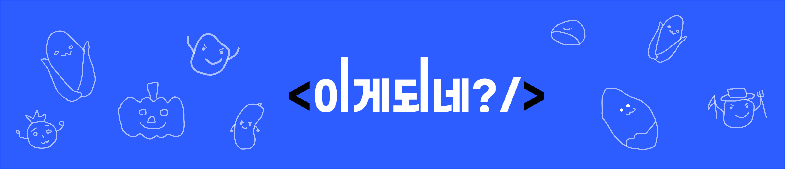
<br><br>

- GitHub repository : https://github.com/what-happens/Team_project_whathappns-
- 배포 URL : https://whathappen.kr
- Test ID : test25@test.com
- Test PW : test1234!

## 프로젝트 소개

- HTML / CSS 입문 수준의 기초 학습을 할 수 있는 프로젝트 입니다!
- 1 ~ 6 단계의 State 에서 이론과 실습을 통해 작은 화면을
  직접 만들어 보며 공부할 수 있습니다!
- 랜덤하게 출제되는 HTML / CSS 의 기초문제들을 퀴즈게임 형태로 직접 풀어보고 틀린문제를 저장하고 북마크 기능을 통해 저장할 수 있습니다
- 틀린문제와 북마크한 문제들을 복습노트에서 확인하고 다시 풀어볼 수 있습니다!

## 💁‍♂️ 프로젝트 팀원

<table>
  <tr>
    <td align="center">
      <br>
      <a href="https://github.com/siwoon1602">윤시운</a>
    </td>
    <td align="center">
      <br>
      <a href="https://github.com/LeeHwiGyoung">이휘경</a>
    </td>
    <td align="center">
      <br>
      <a href="https://github.com/yejin5128">박예진</a>
    </td>
    <td align="center">
      <br>
      <a href="https://github.com/ddhsl">김예원</a>
    </td>
    <td align="center">
      <br>
      <a href="https://github.com/dahyungryu">유다형</a>
    </td>
  </tr>
</table>

<br>

## 1. 개발 환경

- **Front**
- FramWorlk : React
- State Managment : Redux Toolkit, React-Redux, Redux Persist
- Routing: React Router DOM
- Styling: Styled-components, Styled-reset
- ESLint (with Prettier integration) / Prettier (Code Formatter)<br>

  
  
  
  
  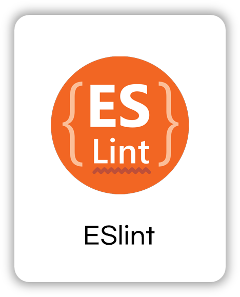
  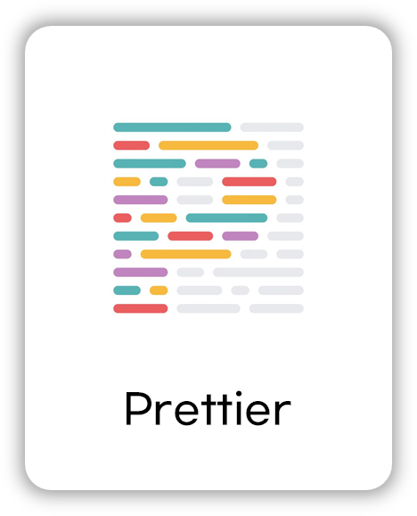

- Back-end : node.js , Firebase , Swagger , Express , CORS , .ENV , Nodemon , PM2 , Nginx
  <br>
  
  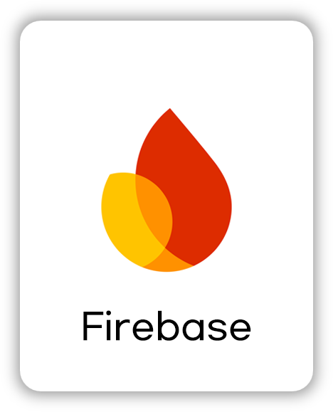
  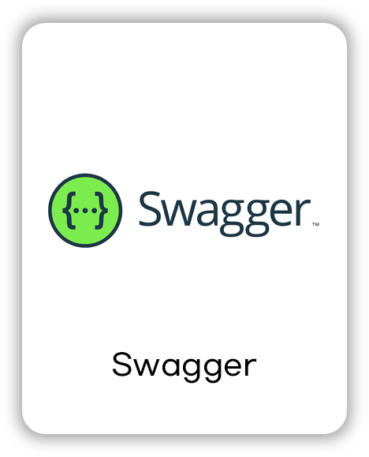
  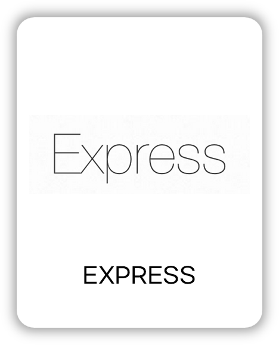
  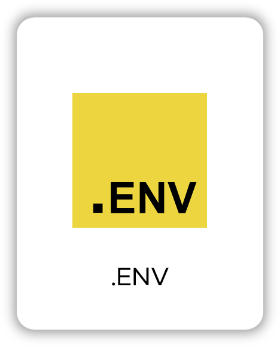
  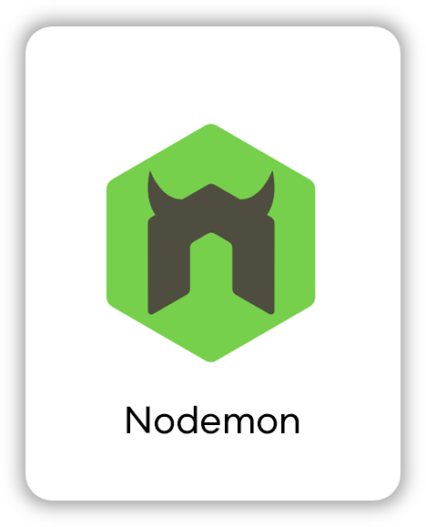
  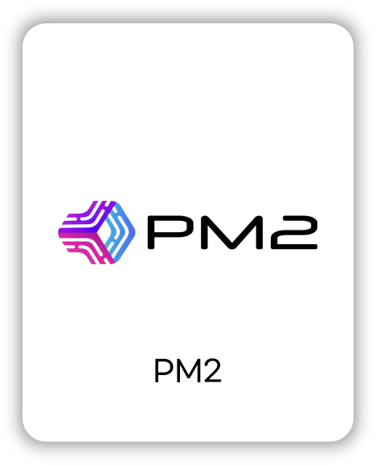
  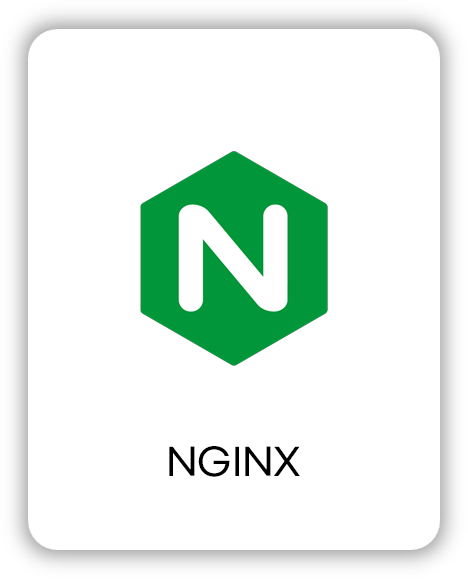
- 버전 관리 : Github<br>
  
- 협업 툴 : Jira , Notion , Discord<br>
  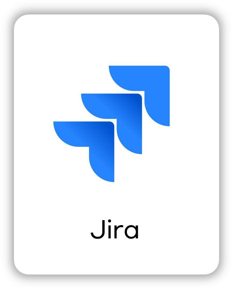
  
  
- 서비스 배포 환경 : GCP VM<br>
  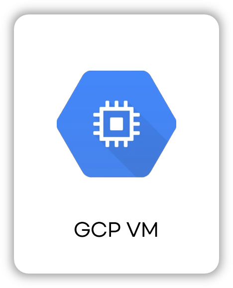
- [Figma](https://www.figma.com/design/H0EHVsa8f529uoYm0Qm1cw/%EC%9D%B4%EA%B2%8C%EB%90%98%EB%84%A4%3F?node-id=3-2&t=0zzJrQMyIiYO3RZV-1)<br>
- [Notion](https://www.notion.so/150d8bd3267a80e29e3df64902fca2bf)
  <br>
- [Jira](https://www.notion.so/150d8bd3267a80e29e3df64902fca2bf)
  <br>

## 2. 채택한 개발 기술과 브랜치 전략

### React, styled-component

- React
  - HTML/CSS 학습 애플리케이션은 인터페이스를 재사용 가능하고 유지보수하기 쉽게 설계해야하기 때문에 . React의 컴포넌트 기반 구조는 버튼, 카드 등 UI 요소를 모듈화하여 효율적인 개발이 가능하기 때문입니다.
- styled-component
  - props를 이용한 조건부 스타일링을 활용하여 상황에 알맞은 스타일을 적용시킬 수 있었습니다.
  - 클래스 이름 충돌을 방지하고, 코드베이스가 커지더라도 스타일 관리가 용이합니다. 컴포넌트별로 스타일이 분리되어 있어 구조화된 코드를 작성할 수 있기 때문입니다.

### Redux

- Redux를 활용한 이유는 학습 진행 현황, 정답/오답 여부, 등등 회원정보 와 같은 전역 상태를 효율적으로 관리하고, 복잡한 상태를 컴포넌트 간에 쉽게 공유할 수 있기 때문입니다.

### eslint, prettier

- 정해진 규칙에 따라 자동적으로 코드 스타일을 정리해 코드의 일관성을 유지하고자 했습니다.
- 코드 품질 관리는 eslint에, 코드 포맷팅은 prettier에 일임해 사용했습니다.
- 협업 시 매번 컨벤션을 신경 쓸 필요 없이 빠르게 개발하는 데에 목적을 두었습니다.

### 브랜치 전략

- main, develop, 개인 브랜치로 나누어 개발을 하였습니다.
  - **main** 브랜치는 배포 단계에서만 사용하는 브랜치입니다.
  - **develop** 브랜치는 개발 단계에서 master 역할을 하는 브랜치입니다.
  - **개인 branch** 브랜치는 팀원 마다 독립적인 개발 환경을 위하여 사용하고 merge 후 각 브랜치를 삭제해주었습니다.

<br>

## 3. 프로젝트 구조

```
├── README.md
├── .eslintrc.json
├── .gitignore
├── .prettierignore.json
├── .prettierrc.json
├── package-lock.json
├── package.json
│
├── public
│    ├── favicon.svg
│    ├── manifest.json
│    ├── robots.txt
│    └── index.html
│
└── src
     ├── App.jsx
     ├── index.jsx
     ├── firebase.config.js
     │
     ├── api
     │    └── mandarinAPI.js
     │
     ├── assets
     │    ├── images
     │    │    ├── logo.png
     │    │    ├── logo_white.png
     │    │    ├── main_banner_vector.png
     │    │    └── loading.gif
     │    └── icons
     │
     ├── components
     │    ├── common
     │    │    ├── Button.jsx
     │    │    ├── Header
     │    │    │    ├── Header.jsx
     │    │    │    ├── AuthHeader.jsx
     │    │    │    └── MobileHeader.jsx
     │    │    ├── Nav
     │    │    │    └── AuthNav.jsx
     │    │    ├── Footer.jsx
     │    │    └── Loading
     │    │         └── InfiniteComponentLoader.js
     │    └── features
     │         └── Bookmark.jsx
     │
     ├── constants
     │    └── stages.js
     │
     ├── data
     │    └── stages
     │         ├── stage0.json
     │         ├── stage1.json
     │         ├── stage2.json
     │         ├── stage3.json
     │         ├── stage4.json
     │         └── stage5.json
     │
     ├── hooks
     │    ├── services
     │    │    ├── useChatService.js
     │    │    └── useFirestore.js
     │    ├── auth
     │    │    ├── useSignup.js
     │    │    └── useLogout.js
     │    └── features
     │         ├── useExercise.js
     │         ├── useFetchQuiz.js
     │         ├── useQuizOptions.js
     │         └── useQuizStep.js
     │
     ├── pages
     │    ├── Home
     │    │    ├── Home.jsx
     │    │    └── components
     │    │         └── Banner.jsx
     │    ├── Quiz
     │    │    ├── Quiz.jsx
     │    │    └── components
     │    │         ├── QuizContent.jsx
     │    │         └── QuizResult.jsx
     │    ├── Exercise
     │    │    ├── Exercise.jsx
     │    │    └── components
     │    │         ├── ExerciseContent.jsx
     │    │         └── ExerciseResult.jsx
     │    ├── Chat
     │    │    ├── Chat.jsx
     │    │    └── components
     │    │         ├── ChatRoom.jsx
     │    │         └── ChatMessage.jsx
     │    └── Auth
     │         ├── Auth.jsx
     │         └── components
     │              ├── Login.jsx
     │              ├── Signup.jsx
     │              └── AuthForm.jsx
     │
     ├── store
     │    ├── index.js
     │    ├── actions
     │    │    ├── authActions.js
     │    │    ├── quizActions.js
     │    │    └── chatActions.js
     │    └── reducers
     │         ├── authReducer.js
     │         ├── quizReducer.js
     │         └── chatReducer.js
     │
     ├── styles
     │    ├── GlobalStyle.js
     │    ├── theme.js
     │    └── MediaQuery.js
     │
     └── utils
          ├── auth.js
          ├── formatting.js
          └── validation.js
```

<br>

## 4. 역할 분담

### 🍊 <a href="https://github.com/what-happens/Team_project_whathappns-/wiki/Siwoon's-Role" target="_blank">윤시운</a>

- **UI/UX**

  - 프로젝트 UI 총 디자인 기획 및 제작
  - Markup / Styleing : 홈 , 로그인, 회원가입 , 회원가입 완료 , 복습노트트 , 404 페이지 , 회원탈퇴
  - 공통 컴포넌트 : Header , Footer , Loading page
  - 페이지 애니메이션 keyframe 적용

- **기능**
  - 로그인 / 로그아웃 기능 , 회원가입 기능 , 복습노트 / 마이페이지 api 연동 / 챗봇 /
  - redux 를 활용한 로그인 상태 관리
  - 개발 초기 firebase 로그인 연동 ( 구글 sns 로그인 포함 )

<br>
    
### 👻이휘경
- **프로젝트 초기 셋팅**
  1. ESLint와 Prettier 설정 및 통합
    - 프로젝트의 코드 품질 관리와 스타일 일관성을 위해 EsLInt와 Prettier를 도입했습니다.
    - 주요 규칙 :
      - Prettier: 코드 포맷팅 표준화.
      - ESLint: 문법 검증 및 코드 컨벤션 체크. React에서 보편적으로 사용되는 eslint-config-react/recommended 규칙을 적용했습니다.
    - 저장 시 자동으로 포맷팅되도록 설정했습니다.(VS Code 사용자: .vscode/settings.json 제공)
    - 환경 설정 : 
      - Mac과 Windows 간 줄 바꿈 차이를 해결하기 위해 줄 바꿈 방식 및 Git의 line ending 설정을 수정할 수 있도록 설정했습니다.
  2. PropTypes 도입
    - TypeScript를 사용하지 않는 환경에서 props의 명확한 문서화와 런타임 오류 방지를 위해 도입했습니다.
    - 모든 컴포넌트의 props 구조를 명시적으로 정의하여 협업 시 가독성을 높이고 유지보수를 용이하게 하고자 도입했습니다.
  3. 공통 패키지 설치
    - 프로젝트에서 공통적으로 사용되는 패키지를 적용했습니다.
      - styled-component :
      - styled-reset : 스타일의 일관성을 위해 글로벌 스타일에 Reset CSS를 적용
      - redux , reduxjs/toolkit : 전역 상태 관리 및 과도한 prop drilling을 방지하기 위해 도입.
      - react-router-dom : React의 애플리케이션의 라우팅 관리

- **담당 페이지**

1. 퀴즈 페이지

- 퀴즈페이지는 여러 스텝으로 구성되어 있으며 퀴즈 페이지에서 스텝에 맞게 다른 컴포넌트를 랜더링합니다.
  각 스텝에서 QuizLanding Page(퀴즈 카테고리 및 문제 선택 페이지), Quiz(실제 퀴즈 풀이 페이지), Quiz Result Page(퀴즈 결과 페이지)를 포함합니다. 저는 주로 Quiz 페이지를 담당했습니다.

- 페이지 별 역할

  1. 퀴즈 페이지

  - Redux 관리: 퀴즈의 스텝, 카테고리, 제한 사항, 사용자 답안 등 공통 상태를 Redux로 관리하여 Props Drilling을 해결하고, 퀴즈 데이터를 효율적으로 처리합니다.
  - useQuizStep 훅: 퀴즈 스텝을 관리하는 로직을 useQuizStep으로 분리하여 중복을 제거하고 재사용성 및 유지보수성을 향상시켰습니다.

  2. 퀴즈 랜딩 페이지

  - 셀렉트 컴포넌트 리팩토링: 퀴즈 랜딩 페이지의 커스텀 셀렉트 컴포넌트가 카테고리와 제한 사항을 동시에 관리하고 있었는데, 이를 재사용 가능하도록 셀렉트 옵션과 상태를 Props로 전달하는 방식으로 리팩토링했습니다.
  - '퀴즈 풀기' 버튼 클릭 시 백엔드 API를 통해 퀴즈 데이터를 가져올 수 있게 했습니다.
  - useFetchQuiz 훅: 퀴즈 랜딩 페이지에서 퀴즈 데이터를 불러오기 위해 useFetchQuiz 훅을 사용하여 백엔드 API에서 퀴즈 데이터를 받아옵니다.
  - 공통으로 사용되는 상태 redux로 분리 : 카테고리와 제한 사항(limit)을 Redux로 관리하도록 리팩토링했습니다.

  3. 퀴즈 풀기 페이지

  - 퀴즈 풀이 페이지의 반응형을 제외한 스타일링 및 마크업을 진행했습니다.
  - 사용자 답안을 선택하고 사용자의 답안을 저장한 뒤, 마지막 문제에서 '제출하기' 버튼을 눌러 정답을 채점하는 기능을 구현했습니다.
  - 프로그래스바로 퀴즈 진행 상황을 시각적으로 표시했습니다.
  - useFetchQuiz 훅: 퀴즈 풀기 페이지에서도 useFetchQuiz 훅을 사용하여 서버와 통신하고, 퀴즈 데이터를 저장하는 기능을 구현했습니다.
  - 퀴즈 종료 시 나가겠냐는 확인 모달을 부모 컴포넌트로 옮겨 재사용 가능하게 리팩토링했습니다.

  4. 퀴즈 결과 페이지

  - 하드코딩된 총 문제 수, 맞힌 문제 수, 틀린 문제 수 등을 동적으로 계산하도록 리팩토링했습니다.

2. 실습 페이지

- 실습 페이지의 초기 마크업 및 스타일링
- 실습 페이지의 반응형 페이지 적용

<br>

### 🍎 박예진

- **담당 페이지**

  - study : 학습 라우팅 페이지
  - StudyLanding : 학습 랜딩 페이지
  - StudyStage : 학습 스테이지 별 레벨 랜딩 페이지
  - StudyContents : 학습내용 페이지
  - StudyFinish : 학습 완료 페이지

- **담당 페이지 개발 요약**

  1. Study 페이지 라우팅
     - react-router 에서 URL 매핑을 부모자식(트리구조)구조로 구현
     - React useParams로 세부 페이지 라우팅 구현, 학습 내용을 쉽게 공유하거나 북마크할 수 있게 URL 파라미터를 활용해 라우팅 처리.

  2. StudyLanding 페이지

     - 학습 랜딩 페이지 스타일링 및 마크업

  3. StudyStage 페이지

     - StudyStage 페이지 스타일링 및 마크업

     <n/>**구현 기능**

     1. React Router의 useParams 사용

     - URL 파라미터에서 stage_id를 받아 사용자가 선택한 스테이지 데이터를 동적으로 렌더링.

     - 서버에서 학습단계 별 완료 여부(clear 상태)를 API 통신으로 받아 학습단계 완료 상태를 표시.

     3. Dynamic Import

     - Dynamic Import 기능을 사용하여 스테이지별 학습 데이터를 프론트엔드 서버에서 동적으로 불러옴.
     - 사용자가 특정 스테이지에 진입할 때, 해당 스테이지에 필요한 데이터를 로드하여 메모리 사용을 최적화하고 초기 로딩 시간을 줄임. 데이터 로딩 중 오류가 발생할 경우 예외 처리를 통해 사용자에게 피드백을 제공.

  4. StudyContents 페이지

     - StudyContents 페이지 스타일링 및 마크업
     - URL 파라미터에서 stage_id와 levelId를 받아 사용자가 선택한 level 데이터를 동적으로 렌더링.
     - Dynamic Import 기능을 사용하여 선택한 레벨의 학습 JSON 데이터를 프론트엔드 서버에서 동적으로 불러옴.
     - 조건부 렌더링으로 학습 콘텐츠 구성
       - 학습 콘텐츠의 이미지, 코드, 외부 링크 등 다양한 요소를 조건부로 렌더링.
       - 불필요한 렌더링을 방지하여 성능 최적화.
       - 가독성과 유지보수성을 고려하여 조건부 렌더링을 활용함.

  5. StudyFinish 페이지

     - StudyFinish 페이지 스타일링 및 마크업

  6. 담당 페이지 반응형 구현

     - Styled-Components의 ThemeProvider를 사용해 반응형 UI 구현
     - 화면 크기에 따라 동적으로 스타일을 변경, 미디어 쿼리와 글로벌 테마 설정으로 코드의 재사용성을 높이고 스타일 관리 효율성을 개선.

- **UI**
  - 공통 패키지 설치 :
    - lucide-react 라이브러리 사용해 StudyContents 페이지의 햄버거 메뉴 아이콘 변경. 직관적인 UI 요소를 구현.
    - React Swiper: React Swiper로 학습 코스 UI 구현 Swiper를 사용해 사용자가 학습 코스를 직관적으로 탐색 가능.

<br>

### 🐬김예원

- **UI**
  - 페이지 : 퀴즈 랜딩페이지/ 퀴즈 결과페이지 / 챗봇 마크업 및 스타일링, 퀴즈풀이 페이지 반응형 구현
  - 공통 컴포넌트 :
- **기능**
  - <br>

### 🐶유다형

- **UI**
  - 페이지 : 메인페이지, 마이페이지, 404 페이지, 러닝페이지, 회원가입 완료 페이지
  - 공통 컴포넌트 : 반응형 헤더
- **기능**
  - 퀴즈카드에서 북마크 추가/ 삭제
    <br>

## 5. 개발 기간 및 작업 관리

### 개발 기간

- 전체 개발 기간 : 2024-11-28 ~ 2024-12-23
- UI 구현 : 2024-11-28 ~ 2024-12-09
- 기능 구현 : 2024-12-09 ~ 2022-12-18
- QA / 문서 작업 : 2024-12-19 ~ 2024-12-22
- 발표 : 2024-12-23

<br>

### 작업 관리

- Jira를 통해 현재 진행중인 작업을 공유하며 일정관리를 하였습니다.
- 매일 Daily Scrum을 진행하며 작업 순서와 방향성에 대한 고민을 나누고 Notion에 회의록을 작성하였습니다.
- 주 3회 고정 merge , 필요한 경우 추가 merge를 통해 빠른 최신화를 통해 오류를 대처하였습니다.

<br>

## 6. 페이지별 기능

### [랜딩페이지]

- 서비스 접속 초기화면으로 서비스에 대한 설명이 무한스크롤로 구현 되어있습니다.
  - 로그인이 되어 있지 않은 경우 : Header의 로그인 버튼
  - 로그인이 되어 있는 경우 : Header 의 로그아웃 버튼과 Nav

| 랜딩페이지                                              |
| ------------------------------------------------------- |
|  |

로그인 Header 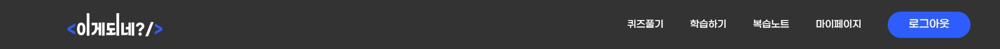

<br>

### [회원가입]

- 가입하기 버튼을 눌렀을때 유효성 검사 실행
- 이메일 주소의 형식이 유효하지 않는경우 , 이미 가입된 이메일일 경우, 비밀번호가 8자 미만일 경우, 입력창이 비어있는 경우에는 각 입력창 하단에 경고 문구가 나타납니다.
- 유효성 검사를 통과하면 회원가입 완료 페이지로 이동

| 회원가입  
| ---------------------------------------------------------- |
| 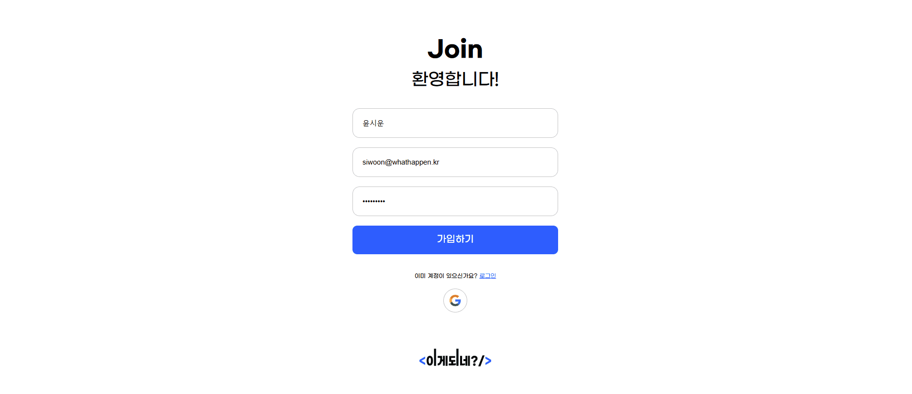 |

유효성 검사 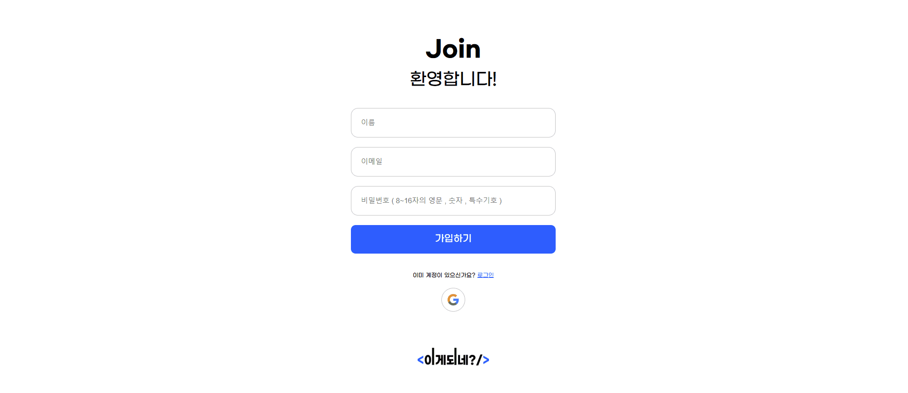
<br>
<br>

### [로그인]

- 로그인 버튼을 누르면 유효성 검사 실행
- 이메일 주소의 형식이 유효하지 않거나 입력창이 비어있는 경우에는, 각 입력창 하단에 경고 문구가 나타납니다.
- 로그인 버튼 클릭 시 이메일 주소 또는 비밀번호가 일치하지 않을 경우에는 입력창 하단에 경고 문구가 나타나며, 로그인에 성공하면 랜딩페이지로 이동합니다.

| 로그인                                                      |
| ----------------------------------------------------------- |
| 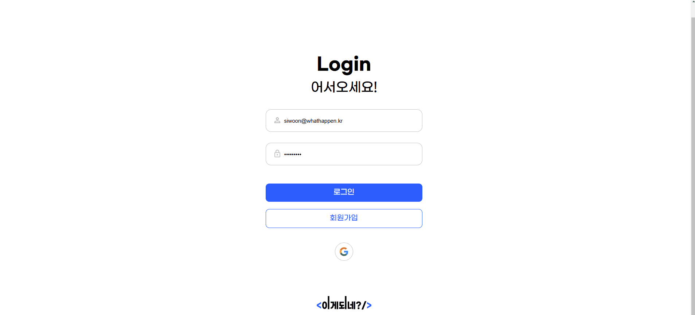 |

유효성 검사 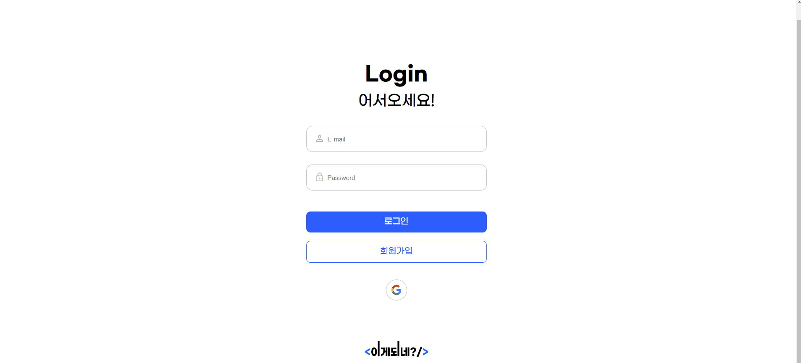
<br>

### [마이페이지]

- 기초학습을 몇 스테이지 까지 진행했는지, 퀴즈풀이를 몇 회 진행했는지, 저장된 퀴즈가 몇 문제인지 확인이 가능합니다.
- 학습 스탬프, 학습 진척도 프로그래스바로 실습 얼마나 진행했는지 확인이 가능합니다.

| 마이페이지                                            |
| ----------------------------------------------------- |
| 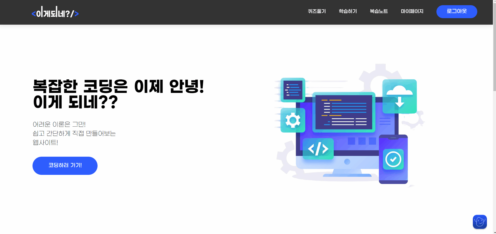 |

<br>

### [복습노트]

- 복습노트에 저장된 퀴즈가 없을 때는 퀴즈 풀러가기 버튼으로 퀴즈를 풀러 갈 수 있습니다.
- "틀린 문제" 탭을 선택했을 때 좌측에는 틀린문제 번호가, 우측에는 틀렸던 문제를 다시 풀어보는 공간이 생깁니다.
- 틀린 문제를 다시 풀고 제출 버튼을 눌렀을 때 문제를 복습노트에서 삭제 여부를 묻는 모달이 나타납니다.
- "북마크" 탭을 선택했을 때 좌측에는 북마크 된 문제의 번호가, 우측에는 북마크 된 문제를 다시 풀어보는 공간이 생깁니다.
- "북마크" 버튼을 클릭했을때 북마크 추가 , 삭제 기능 사용가능

| 복습노트
| ----------------------------------------------------------- |
|  |

북마크 추가 삭제 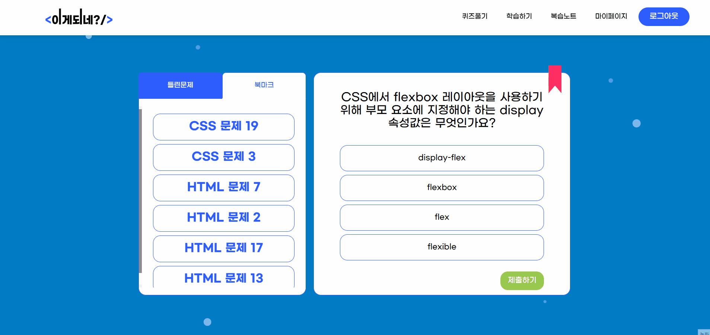
문제가 존재하지 않을 시 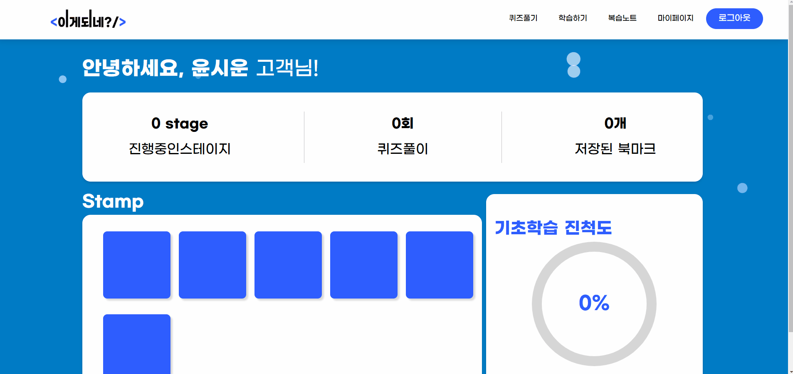

<br>

### [퀴즈페이지]

- HTML, CSS 중에서 퀴즈 종류를 고를 수 있습니다.
- 5문제, 10문제, 15문제, 20문제 등 퀴즈의 수를 원하는 대로 설정할 수 있습니다. 퀴즈 풀기 버튼을 누르면 퀴즈가 시작됩니다.
- 뒤로가기 버튼을 누르면 이전 페이지로 돌아갑니다.

| 퀴즈 랜딩페이지                                       |
| ----------------------------------------------------- |
|  |

### [퀴즈풀이]

- 퀴즈페이지에서 퀴즈 풀기 버튼을 누르면 나오는
- 퀴즈가 시작되면 답을 선택하고 다음이나 이전 문제로 넘어갈 수 있습니다.
- 문제를 다 풀면 퀴즈 결과 페이지로 이동됩니다.

| 퀴즈 게임페이지                                              |
| ------------------------------------------------------------ |
|  |

<br>

### [퀴즈결과]

- 퀴즈를 다 풀면 이 페이지로 넘어옵니다. 전체 문제 중에서 몇 문제를 맞혔는지, 몇 문제 틀렸는지를 보여줍니다.
- 복습 노트 저장 버튼을 누르면 틀린 문제와 북마크된 문제를 모두 복습노트에 저장되었다는 모달이 뜹니다.
- 처음으로 버튼을 누르면 퀴즈페이지로 돌아갑니다.

| 퀴즈결과창  
| -------------------------------------------------------------- |
| 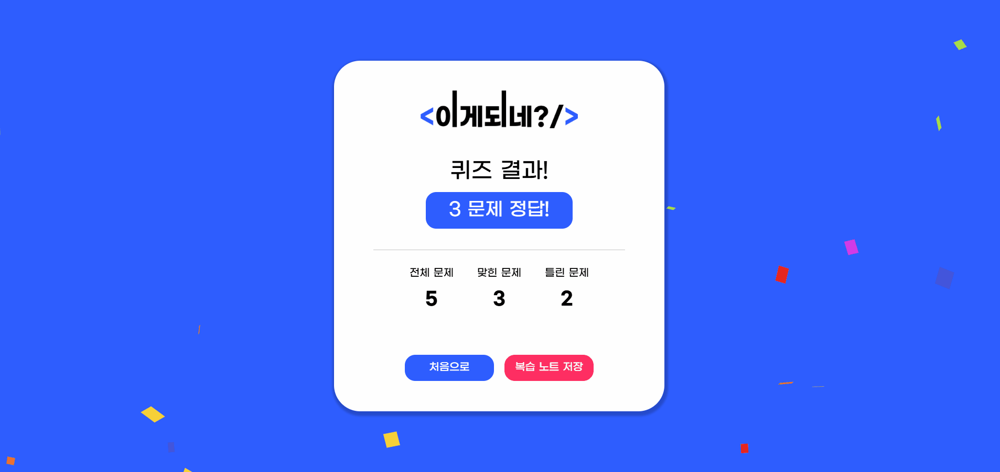 |

<br>

### [학습스테이지]

- stage 버튼을 누르면 각각의 스테이지로 넘어가게 됩니다.
- 각 스테이지를 완료하면 마이페이지에 학습 스탬프가 찍히게 됩니다.

| 학습스테이지                                 |
| -------------------------------------------- |
|  |

<br>

### [러닝코스]

- 학습스테이지 페이지에서 각 스테이지를 누르면 나오는 화면입니다. 스테이지 안의 레벨을 확인할 수 있습니다.
- 스크롤 / 버튼으로 레벨을 확인할 수 있습니다.

| 러닝코스페이지                                     |
| -------------------------------------------------- |
|  |

<br>

### [학습페이지]

- 실습에 들어가기 전 학습을 하는 페이지입니다.
- 좌측 메뉴에서 각 레벨의 목록을 확인할 수 있습니다. 목록에서

| 학습페이지                                       |
| ------------------------------------------------ |
|  |

<br>

### [mr.potato]

- ALAN AI를 탑재한 챗봇에게게 질문이 가능합니다.
- 사용자가 질문하면 기초 학습하는 유저임을 인식하고 , 출처를 제외한 정보를 회신합니다.

| ON / OFF                                                     | 실시간 채팅 기능                                              |
| ------------------------------------------------------------ | ------------------------------------------------------------- |
| 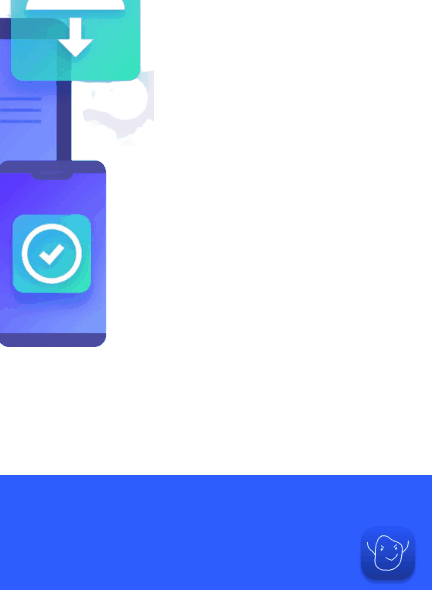 | 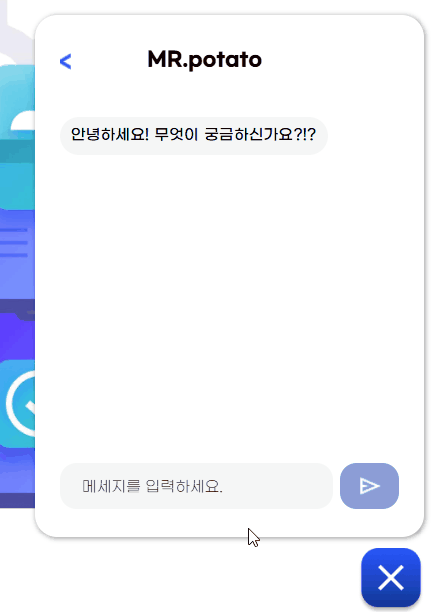 |

<br>

### [실습페이지]

- 좌측에서 탭으로 주어진 문제의 html 코드와 css 코드를 확인할 수 있습니다.
- 우측 상단에는 문제가 주어지고, 완성될 정답 화면을 확인할 수 있습니다.
- 우측 하단에서는 자신이 구현중인 화면을 확인할 수 있습니다.
- 하단에는 버튼 형식으로 문제의 보기가 주어집니다.
- 다음으로 버튼을 누르면 다음에 학습할 내용이 담긴 학습페이지로 넘어갑니다.

| 실습페이지                                      |
| ----------------------------------------------- |
|  |

<br>

### [학습완료페이지]

- 학습이 완료되면 표시되는 페이지입니다.
- 메인페이지로 이동 버튼을 누르면 랜딩페이지로 이동됩니다.

| 학습완료페이지  
| ---------------------------------------------------------------- |
| 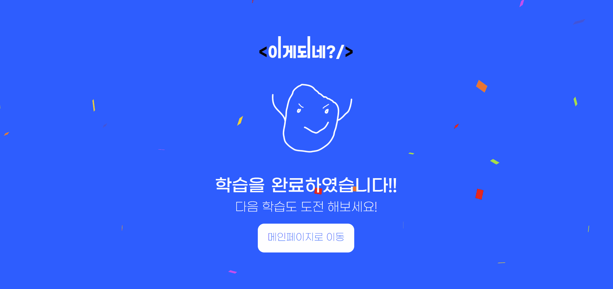 |

<br>

### [404에러페이지]

- 404 에러일 때 나타나는 페이지입니다.
- 스페이스 바를 누르면 게임을 시작할 수 있습니다.
- 메인페이지로 이동 버튼을 누르면 랜딩페이지로 이동됩니다.

| 에러페이지                                      |
| ----------------------------------------------- |
| 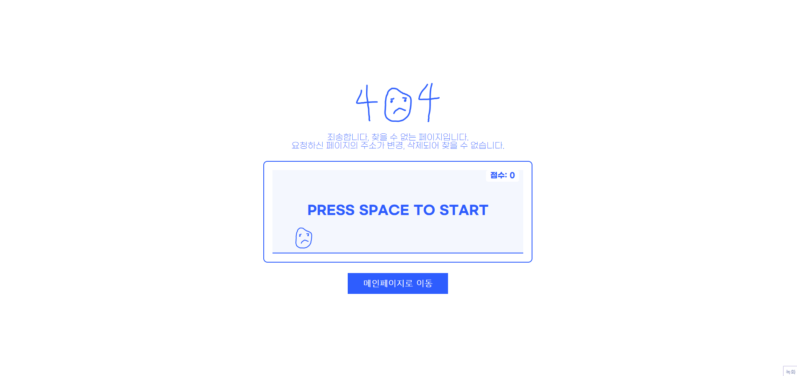 |

<br>

## 7. 트러블 슈팅

- <a href="https://github.com/what-happens/Team_project_whathappns-/wiki/Siwoon's-Trouble-shooting" target="_blank">윤시운</a>
- <a href="https://github.com/what-happens/Team_project_whathappns-/wiki/hwigyoung's-Trouble-shooting" target="_blank">이휘경</a>
- <a href="https://github.com/what-happens/Team_project_whathappns-/wiki/Siwoon's-Trouble-shooting" target="_blank">박예진</a>
- <a href="https://github.com/what-happens/Team_project_whathappns-/wiki/Siwoon's-Trouble-shooting" target="_blank">김예원</a>
- <a href="https://github.com/what-happens/Team_project_whathappns-/wiki/Siwoon's-Trouble-shooting" target="_blank">유다형</a>

<br>

## 8. 개선 목표

- API 통신이나 Validation 같은 기능들은 hook으로 만들어 사용 할 수 있게끔 개선 필요
- 웹 접근성을 고려하여 TAB 탐색을 통해 모든 서비스를 이용 할 수 있게끔 개선 필요
- 아이디 / 비밀번호 찾기 , 개인정보 보호 동의 등 회원관련 서비스 추가 및 개선 필요
- 다양한 에러 코드에 대한 에러 핸들링 개선
- 그 외 복잡한 코드구조 , 리팩토링

<br>

## 9. 프로젝트 후기

### 🍊 윤시운

느낀점

<br>

### 👻 이휘경

느낀점

<br>

### 😎 박예진

1. 개인 또는 우리팀이 잘한 부분과 아쉬운 점
2. 프로젝트 결과물의 추후 개선점이나 보완할 점 등 내용 정리
3. 프로젝트를 수행하면서 느낀점이나 경험한 성과

<br>

### 🐬 김예원

느낀점

<br>

### 🐶 유다형

느낀점
